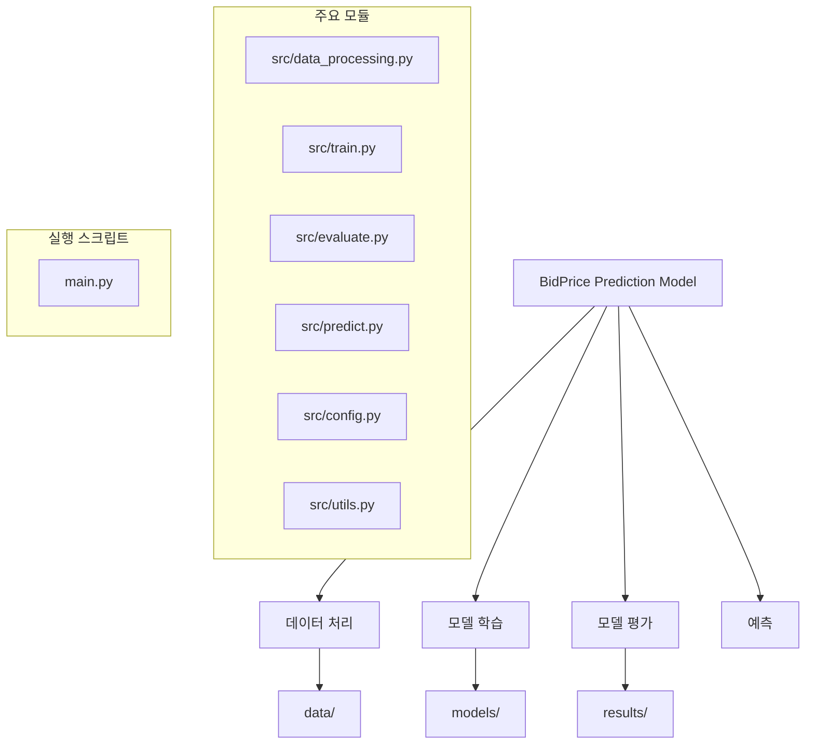
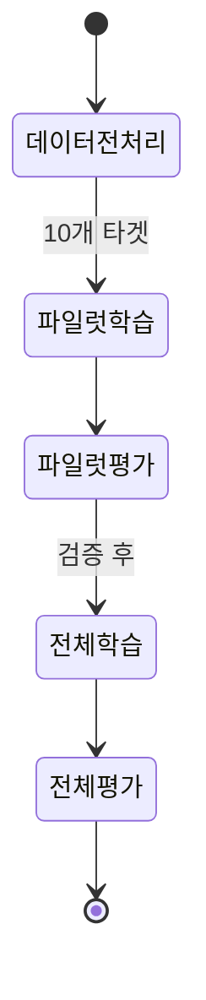
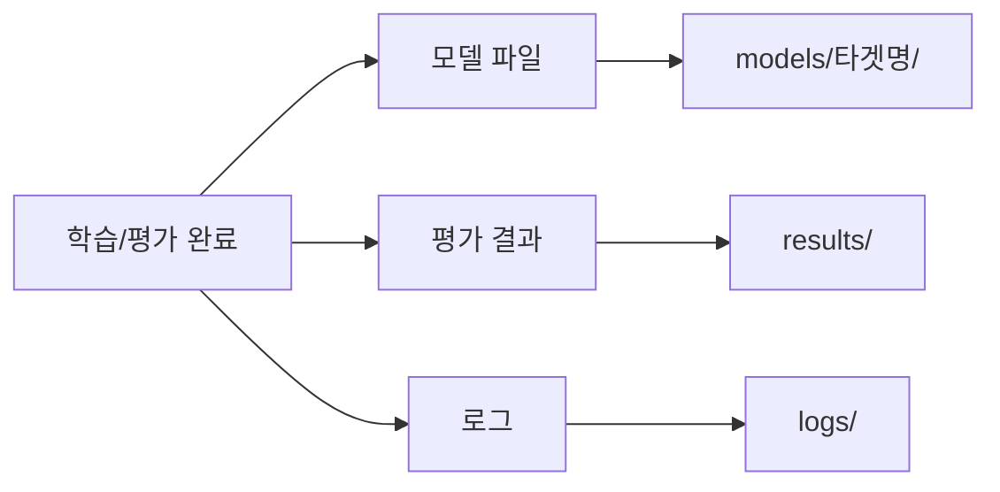

<<<<<<< HEAD
# bidPriceStatsAnalysis
=======
# BidPrice Prediction Model

이 프로젝트는 입찰가격(BidPrice) 예측을 위한 머신러닝 모델 파이프라인입니다. AutoGluon 라이브러리를 활용하여 다수의 타겟 변수(최대 180개)에 대한 효율적인 모델링을 수행합니다.

> [!NOTE]
> 이 프로젝트는 Python 3.8 이상이 필요하며, GPU 가속 기능을 지원합니다.

## 프로젝트 구조



프로젝트는 다음과 같은 디렉토리 구조로 구성됩니다:

- `data/` - 원본 및 전처리된 데이터 파일
- `models/` - 학습된 모델 파일
- `results/` - 평가 결과 및 시각화 이미지
- `src/` - 소스 코드 모듈
- `tests/` - 테스트 코드
- `main.py` - 메인 실행 스크립트
- `requirements.txt` - 필요 패키지 목록

## 설치 방법

<details>
<summary>설치 단계 보기</summary>

1. Python 3.8 이상 설치
2. 필요 패키지 설치:

```bash
pip install -r requirements.txt
```

또는 주요 패키지 직접 설치:

```bash
pip install autogluon pandas numpy matplotlib seaborn scikit-learn tqdm
```
</details>

## 기본 워크플로우


### 전체 파이프라인 실행

```bash
python main.py
```

### 데이터 전처리만 실행

```bash
python main.py --data-only
```

### 모델 학습만 실행

```bash
python main.py --train-only
```

### 모델 평가만 실행

```bash
python main.py --evaluate-only
```

## 터미널 출력 및 진행 상황 표시

파이프라인 실행 시 터미널에 진행 상황이 시각적으로 표시됩니다. 각 단계별로 진행바가 표시되어 처리 상태를 실시간으로 확인할 수 있습니다.

### 예시 출력

```
🚀 BidPrice 예측 파이프라인을 시작합니다...

📊 데이터 전처리 단계를 시작합니다...
📊 데이터 전처리:  60%|██████    | 3/5 [00:23<00:15,  7.67s/it]

✅ 데이터 전처리 완료! 학습 데이터: (13182, 24), 테스트 데이터: (3296, 24)

🧠 모델 학습 단계를 시작합니다...
🧠 [3/30] 020_003 학습 중:  10%|█         | 3/30 [06:47<1:01:02, 135.64s/it]
  🔥 GPU를 사용하여 020_003 학습 중...
```

### 추가 설정

터미널 출력 상세 수준을 조정할 수 있습니다:

```bash
python main.py --verbose 0  # 간략한 출력 (진행바만 표시)
python main.py --verbose 1  # 기본 출력 (기본값)
python main.py --verbose 2  # 상세 출력 (하위 단계까지 표시)
```

## 커맨드라인 옵션

| 옵션 | 설명 | 기본값 |
|------|------|--------|
| `--data-only` | 데이터 전처리만 실행 | False |
| `--train-only` | 모델 학습만 실행 | False |
| `--evaluate-only` | 모델 평가만 실행 | False |
| `--num-targets N` | 처리할 타겟 컬럼 수 | 전체 |
| `--gpu BOOL` | GPU 사용 여부 | True |
| `--models LIST` | 사용할 모델 목록 (콤마로 구분) | 전체 모델 |
| `--preset PRESET` | AutoGluon 프리셋 | medium_quality_faster_train |
| `--verbose N` | 출력 상세 수준 (0: 간략, 1: 기본, 2: 상세) | 1 |

## 사용 예시

<details>
<summary>처음 30개 타겟에 대해서만 학습</summary>

```bash
python main.py --train-only --num-targets 30
```
</details>

<details>
<summary>CPU만 사용하여 학습</summary>

```bash
python main.py --train-only --gpu False
```
</details>

<details>
<summary>특정 모델만 사용하여 학습</summary>

```bash
python main.py --train-only --models XGB,RF
```
</details>

<details>
<summary>고품질 설정으로 학습 (시간 오래 걸림)</summary>

```bash
python main.py --train-only --preset best_quality
```
</details>

<details>
<summary>일부 타겟에 대해서만 평가</summary>

```bash
python main.py --evaluate-only --num-targets 50
```
</details>

## 활용 시나리오

### 단계적 개발 프로세스



1. 데이터 전처리
   ```bash
   python main.py --data-only
   ```

2. 일부 타겟 모델 학습 (파일럿)
   ```bash
   python main.py --train-only --num-targets 10
   ```

3. 파일럿 모델 평가
   ```bash
   python main.py --evaluate-only --num-targets 10
   ```

4. 전체 타겟 모델 학습
   ```bash
   python main.py --train-only
   ```

5. 전체 모델 평가
   ```bash
   python main.py --evaluate-only
   ```

## 메모리 관리 및 성능 최적화

> [!TIP]
> 대규모 데이터셋에서는 타겟 수 제한과 경량 모델 사용으로 메모리 사용량을 줄일 수 있습니다.

### 메모리 부족 시 대처

- 타겟 수 제한: `--num-targets 30`
- 경량 모델만 사용: `--models RF,LR,KNN`
- 여러 배치로 나누어 처리

### 학습 속도 향상

- 빠른 프리셋 사용: `--preset good_quality_faster_inference`
- 경량 모델 선택: `--models RF,LR`

## 결과 확인



- 모델 파일: `models/[타겟명]/` 
- 평가 결과: `results/` 
- 로그: `logs/`

## 주의사항

> [!WARNING]
> AutoGluon은 학습 과정에서 상당한 컴퓨팅 리소스를 사용합니다. 시스템 사양을 확인하세요.

- 대용량 데이터셋 처리 시 충분한 시스템 메모리 필요
- GPU 메모리 제한 있을 경우 타겟 수 제한 권장
- AutoGluon은 학습 과정에서 상당한 컴퓨팅 리소스 사용 
>>>>>>> e245cee (complete data train evaluation)
